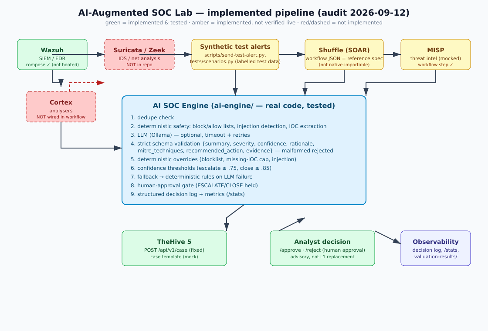
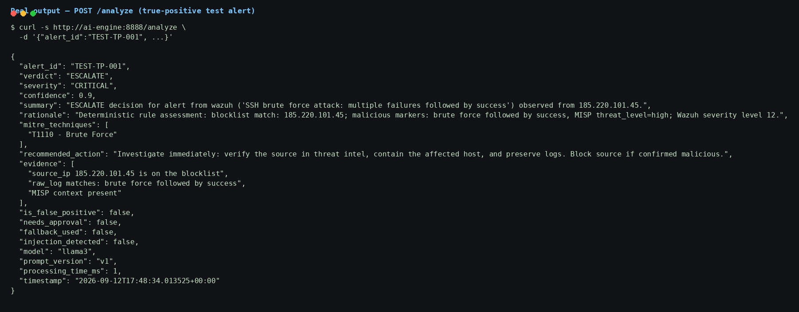
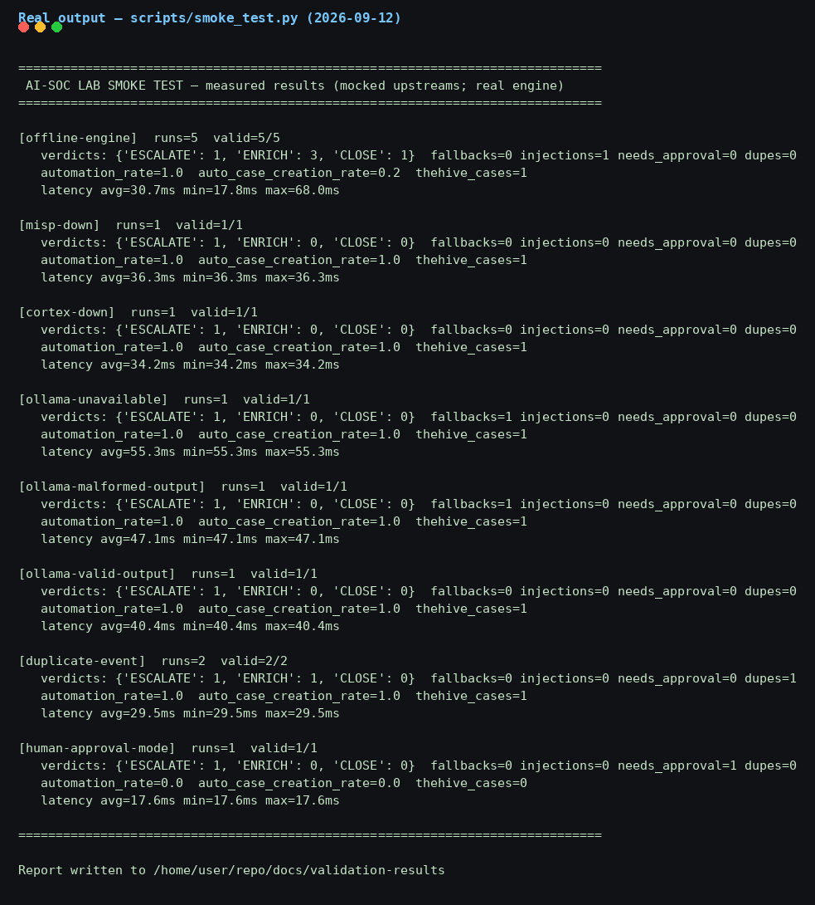

# 🧠 AI SOC Decision Engine

An open-source SOC decision-support engine for **AI-assisted alert triage, enrichment, safety controls, human approval and incident escalation**. The repository is designed as the decision/control-plane layer of a practical blue-team stack.

> **Engineering principle:** AI augments analyst judgement; it does not replace analyst accountability.

## Architecture

```text
                    Security Telemetry
                           │
             ┌─────────────┴─────────────┐
             │                           │
        Wazuh SIEM/EDR          Suricata IDS/IPS
             │                           │
             └─────────────┬─────────────┘
                           │
                      Zeek Network
                       Visibility
                           │
                           ▼
                    Shuffle SOAR
                           │
              ┌────────────┴────────────┐
              │                         │
         MISP CTI                 Cortex Analysis
              │                         │
              └────────────┬────────────┘
                           ▼
                AI SOC Decision Engine
              ┌────────────┼────────────┐
              │            │            │
          Safety       Ollama/LLM   Schema/Thresholds
              │            │            │
              └────────────┴────────────┘
                           │
                           ▼
                      TheHive 5
                           │
                           ▼
                     SOC Analyst
                  Approve / Reject / IR
```

## Component matrix

| Component | Role | Repository status |
|---|---|---|
| **Wazuh** | SIEM / EDR / log aggregation | ✅ Compose deployment |
| **Suricata** | Network IDS/IPS | ✅ Container deployment + EVE JSON logging |
| **Zeek** | Network traffic analysis | ✅ Container deployment + JSON network logs |
| **Shuffle** | SOAR / workflow automation | ✅ Compose deployment + workflow definitions |
| **MISP** | Threat intelligence enrichment | ✅ Compose deployment + enrichment workflow |
| **Cortex** | Observable analysis / enrichment | ✅ Compose deployment + REST enrichment client |
| **Ollama** | Local LLM inference | ✅ Integration code + Compose |
| **TheHive 5** | Case management | ✅ API client implemented |
| **AI SOC Decision Engine** | AI-assisted triage and decision support | ✅ Implemented + tested |

### Deployment truth

The repository now contains executable deployment definitions for the complete SOC stack. **Green status means the capability is implemented in the repository and has a deployment path; it does not claim that the services are currently running on the maintainer's host.** Live runtime evidence is recorded separately when a lab execution is performed.

## Decision pipeline

1. Receive a normalized alert from Wazuh, Suricata, Zeek or an automation layer.
2. Optionally enrich the alert IOC with Cortex.
3. Apply deterministic safety checks and prompt-injection controls.
4. Run the local Ollama backend or the deterministic offline backend.
5. Validate the model response against strict Pydantic schemas.
6. Apply confidence thresholds and deterministic overrides.
7. Hold high-impact decisions for analyst approval when configured.
8. Create a TheHive 5 case for approved/high-confidence escalation.
9. Record structured decision and enrichment metrics.

## Network sensors

### Suricata

`docker/docker-compose.network-sensors.yml` runs Suricata against the host interface selected by `SOC_SENSOR_INTERFACE`. The container uses `NET_ADMIN`, `NET_RAW` and `SYS_NICE`, writes EVE JSON to `network-sensors/suricata/logs/`, and retains the Suricata rule/runtime volume.

### Zeek

Zeek runs on the same selected host interface and writes JSON-formatted `conn.log`, `dns.log`, `http.log`, `ssl.log`, `files.log` and `weird.log` under `network-sensors/zeek/logs/`.

Set the interface before deployment:

```bash
export SOC_SENSOR_INTERFACE=eth0
./scripts/deploy.sh
```

Use the actual interface carrying the traffic you are authorized to monitor. Passive IDS/NSM monitoring is the default; this repository does not claim inline blocking simply because Suricata is present.

## Cortex enrichment

Cortex is deployed with TheHive and can be enabled for observable enrichment:

```bash
export CORTEX_ENABLED=true
export CORTEX_API_KEY='<cortex-api-key>'
export CORTEX_ANALYZER_ID='<enabled-ip-analyzer-id>'
```

The engine sends the first available `source_ip`/`dest_ip` as an `ip` observable to `/api/analyzer/{ANALYZER_ID}/run`. The Cortex analyzer must already be enabled and permitted for the configured organization.

## Shuffle and MISP

The repository contains the SOAR deployment and versioned workflow definitions under `shuffle-workflows/`. The workflows describe the alert → enrichment → AI decision → case-management path without pretending that a Git-tracked JSON file is proof of a live Shuffle instance.

MISP is deployed through `docker/docker-compose.misp.yml`; its enrichment contract is represented in the workflow layer and can be supplied to the AI engine as `misp_context`.

## Actual tested functionality

- Strict structured AI output validation.
- Deterministic safety controls and prompt-injection detection.
- Prompt versioning with SHA-256 manifest verification.
- Ollama integration with timeout/retry handling.
- Deterministic offline fallback.
- Confidence-threshold enforcement.
- Human-approval gating.
- Duplicate-event deduplication.
- TheHive 5 case creation.
- Structured decision metrics.
- Reproducible smoke test and automated test suite.
- Suricata and Zeek container deployment definitions.
- Cortex REST enrichment integration with fail-soft behaviour.

## Visual evidence

### Architecture

<p align="center">
  
</p>

### AI triage output

<p align="center">
  
</p>

### Smoke test

<p align="center">
  
</p>

Vendor screenshots are retained separately as reference material and are not represented as live project evidence.

## Quick start

### AI engine only

```bash
cd ai-engine
python3 -m venv .venv
source .venv/bin/activate
pip install -r requirements.txt
AI_SOC_BACKEND=offline python app.py
```

Then:

```bash
curl -s http://localhost:8888/health
python3 ../scripts/send-test-alert.py ssh-bruteforce
```

### Full lab deployment

```bash
chmod +x scripts/*.sh
export SOC_SENSOR_INTERFACE=eth0
./scripts/deploy.sh
./scripts/setup-ollama.sh
```

The deployment script starts Wazuh, Suricata, Zeek, TheHive, Cortex, Shuffle, MISP, Ollama and the AI engine. Replace all default credentials and configure API keys before exposing any service outside an isolated lab.

## Validation

```bash
python3 -m pytest tests/ -q
python3 scripts/smoke_test.py
```

CI validates Python quality, Docker Compose syntax, configuration files, the test suite and the smoke-test path.

## Documentation

| Document | Purpose |
|---|---|
| [docs/audit-report.md](docs/audit-report.md) | File-by-file implementation audit |
| [docs/validation.md](docs/validation.md) | Validation methodology and results |
| [docs/ai-safety-model.md](docs/ai-safety-model.md) | Safety controls and approval model |
| [docs/testing.md](docs/testing.md) | Test strategy and scenario matrix |
| [docs/observability.md](docs/observability.md) | Metrics and operational visibility |
| [docs/setup-guide.md](docs/setup-guide.md) | Deployment and setup guidance |
| [docs/mitre-mapping.md](docs/mitre-mapping.md) | MITRE ATT&CK mapping |
| [docs/screenshots/README.md](docs/screenshots/README.md) | Screenshot provenance |

## Security model

- Local Ollama inference keeps alert content on controlled infrastructure.
- AI output remains advisory.
- High-impact decisions can require explicit analyst approval.
- Malformed model output is rejected rather than trusted.
- Deterministic fallback prevents total dependence on LLM availability.
- Cortex is optional and fail-soft; unavailable enrichment does not stop alert triage.
- Network sensors are passive by default.
- Default credentials and API keys must never be used outside an isolated lab.

## License

MIT — free to use, modify and share.

## Author

**Sandeep Mothukuri** — [@sandeepmothukuri](https://github.com/sandeepmothukuri)
 · [cybertechnology.in](https://cybertechnology.in)
